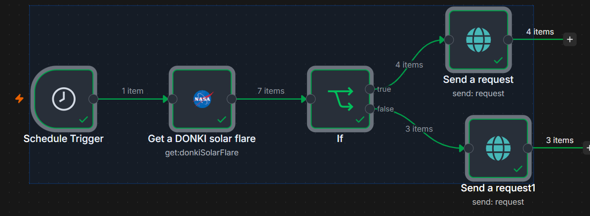

# Project 0 — NASA_Test_WF

> One-sentence summary: Captures and Categorizes Solar Flares recorded by NASA in the previous 7 days.

**Status:** Complete · **Difficulty:** Beginner · **Week:** 0

## Problem

PostBin Access instability

## Architecture

```
Trigger ──▶ NASA; Get a DONKI solar flare ──▶ if True ──▶ Send a request (True) to PostBin; if False ──▶ Send a request (False) to PostBin
```

| Node | Type | Why |
| --- | --- | --- |
| Schedule Trigger | `scheduleTrigger` v1.4 | Fires weekly, Mondays at 09:00 in the container timezone (`GENERIC_TIMEZONE`, not UTC). A weekly cadence matches the 7-day lookback so windows tile without gaps or overlap. |
| Get a DONKI solar flare | `nasa` v1 | NASA DONKI `donkiSolarFlare` resource. `startDate` is `{{ $today.minus(7, 'days') }}`; `endDate` is left at its default (today), giving a rolling 7-day window. |
| If | `if` v2.3 | Splits on `{{ $json.classType }}` **contains** `"M"`. Strict type validation is on, so a missing or non-string `classType` errors rather than silently taking the false branch. |
| Send a request / Send a request1 | `postBin` v1 | Post the result to a PostBin bin — a throwaway HTTP sink used instead of a real downstream system while learning. |

No sub-workflows. Credentials are referenced by name (`NASA account`) and id only; no secret material is in the export.

**Known gap:** both PostBin nodes post identical `binContent` to the identical `binId`, so the
M-class split is computed but not actually reflected in what gets sent. The true/false branches are
currently indistinguishable downstream. Differentiating the two messages is the obvious next fix.

## Error handling

None is configured yet — no node sets `onError`, `retryOnFail`, or a timeout, and there is no error
workflow attached. Current behavior on failure, and what it should become:

| Dependency | What happens today | Should be |
| --- | --- | --- |
| NASA DONKI API down / timeout | Node throws, execution stops, nothing posted, no alert | `retryOnFail` with backoff; error workflow to notify |
| NASA auth failure (401/403) | Execution stops with an auth error | Fail loudly — a retry won't fix a bad key |
| NASA rate limit (429) | Execution stops | Retry with backoff; `DEMO_KEY` is limited to ~30 req/hr, a personal key to ~1,000 |
| Empty result (a quiet solar week) | Zero items reach the If node, both branches no-op silently | Acceptable, but worth logging so "no run" is distinguishable from "no flares" |
| `classType` missing/non-string | If node errors, because type validation is strict | Intentional — surfaces bad data instead of miscategorizing it |
| PostBin unreachable or bin expired | Node throws after NASA data is already fetched; no retry | The instability that motivated this project; a durable sink is the real fix |

## Security notes

- **Auth model.** One credential, `NASA account` (`nasaApi`), held in n8n's encrypted credential
  store. The exported JSON carries only the credential's name and id — no key — so the file is safe
  to commit. Verified before each commit.
- **Scopes.** NASA DONKI is a read-only public `GET` API with no scope or permission model; the key
  exists for rate-limit accounting, not authorization. Nothing here can write to NASA.
- **Inbound surface.** None. This is schedule-triggered, not webhook-triggered, so there is no
  endpoint to authenticate or validate.
- **Outbound data.** The `binId` in this export is a public PostBin bin — anyone holding the id can
  read what was posted to it. Only public NASA space-weather data is sent, so committing the id
  leaks nothing, but this is exactly why PostBin is a learning sink and not a production one.
- **AI / untrusted text.** No AI nodes and no human-approval gate; no model consumes the API
  response, so there is no prompt-injection path to defend.

## What broke / lessons learned

Knowing the correct NASA API's and configuration settings for effective solutioning. Process and API documentation helpful

## Demo


